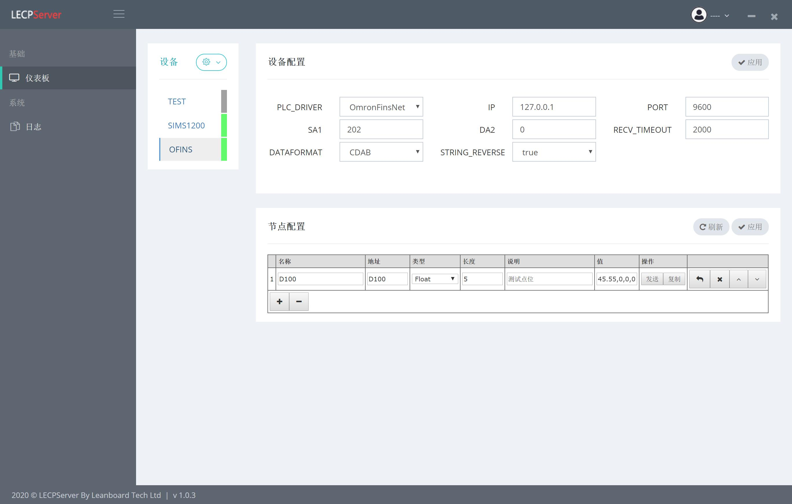
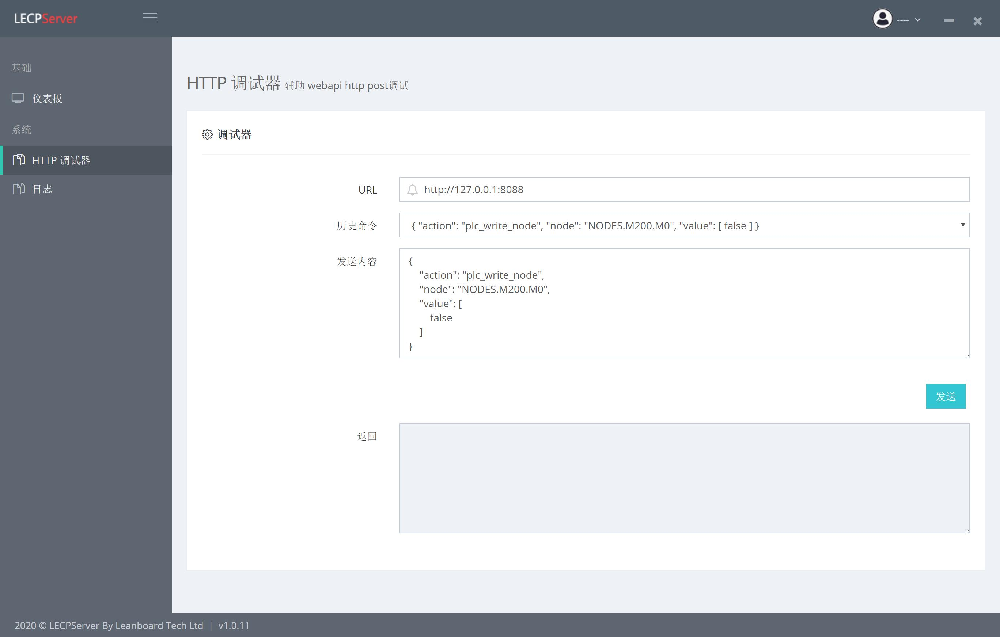

# LECPServer

A faster and more concise open source PLC communication middleware than kepserver

LECPServer 全称 Leanboard Equipment Communication Proxy Server 是一款基于 JLean 框架开发的高性能工业用组态服务软件，可以通过该组态软件，链接市面上90%的PLC，通过HTTP协议通联PLC的读写，使用户能够通过一个直观的用户界面来连接、管理、监视和控制不同的自动化设备和软件应用程序。

LECPServer 让用户能够以安全、可靠、高效地方式获取所有主流自动化供应商系统的数据，并对数据进行二次加工和利用，效率会比市面上大部分组态软件，如KepServer、Matrikonopc 要高效。

Website: http://www.lecpserver.com

Documentation: http://www.lecpserver.com:3001/

Source code: https://github.com/xeden3/LECPServer

Bug reports: https://github.com/xeden3/LECPServer/issues

## LECPServer 环境要求

操作系统：

* Windows 10 x64 (专业版和企业版)
* Windows 8.1 x64 (Windows 8、专业版和企业版)
* Windows 8 x64 (Windows 8、专业版和企业版)
* Windows 7 x64 (专业版、旗舰版和企业版)
* Windows Server 2016 x64
* Windows Server 2012 x64 R2
* Windows Server 2012 x64

系统最低配置如下:

* INTEL I3 或同等级别处理器
* 4GB 内存 (遵从操作系统建议)
* 500 MB 可用磁盘空间
* 以太网卡

系统需要安装的辅助运行时软件

LECPServer目前是基于 JLean v2.2.x 版本开发，而JLean v2.2.x版本需要以下辅助运行时软件

* Microsoft .NET Framework 4.6.1或以上
* Visual C++ Redistributable Packages for Visual Studio 2013

> Microsoft .NET Framework 4.6.1 https://dotnet.microsoft.com/download/dotnet-framework/thank-you/net461-web-installer

> Visual C++ Redistributable Packages for Visual Studio 2013 https://www.microsoft.com/zh-cn/download/details.aspx?id=40784

## 用户界面

## 功能特性

* 简洁明了的图形操作界面
* WebAPI读写支持
* 海量PLC通讯协议支持
* 高效负载
* 国际化 [查看已可选的语言](#国际化)
* HTTP Debugger 工具
* 系统日志

## 性能测试

测试设备
1. CPU INTEL Core I7-1065G7 1.30Ghz处理器
2. 16GB DDR4 内存
3. SSD M2 磁盘
4. Windows10 专业版 1909 64bit 操作系统
5. 施耐德 TM200CE24R PLC

测试方法
1. 给PLC设置一个BOOL点位C0000和一个WORD点位H0000，开启50个读线程和50个写线程，运行 plc_read_node 和 plc_write_node 命令，测试两个命令的响应速度
2. 给PLC设置一个BOOL点位C0000和一个WORD点位H0000，开启50个读线程和50个写线程，运行 plc_read_nodes 和 plc_write_nodes 命令，测试两个命令的响应速度

结论，第一组测试结果，50个读线程和50个写线程，针对单个线程的读写返回时间在10ms-13ms，第二组测试结果，50个读线程和50个写线程，针对单个读写返回时间在20ms-24ms

## 国际化
欢迎大家将 LECPServer 翻译成更多的语言版本。

| Key | 语言 |状态|
|----- |------|----|
| cn | 简体中文 | ✔️ @xeden3
| en| English | ✔️ @xeden3
| jp | 日本語 | @xeden3

